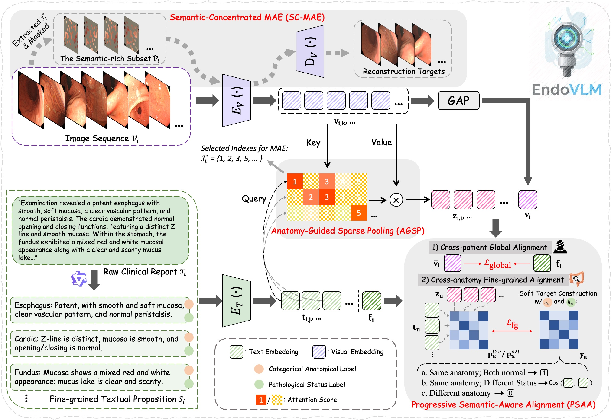
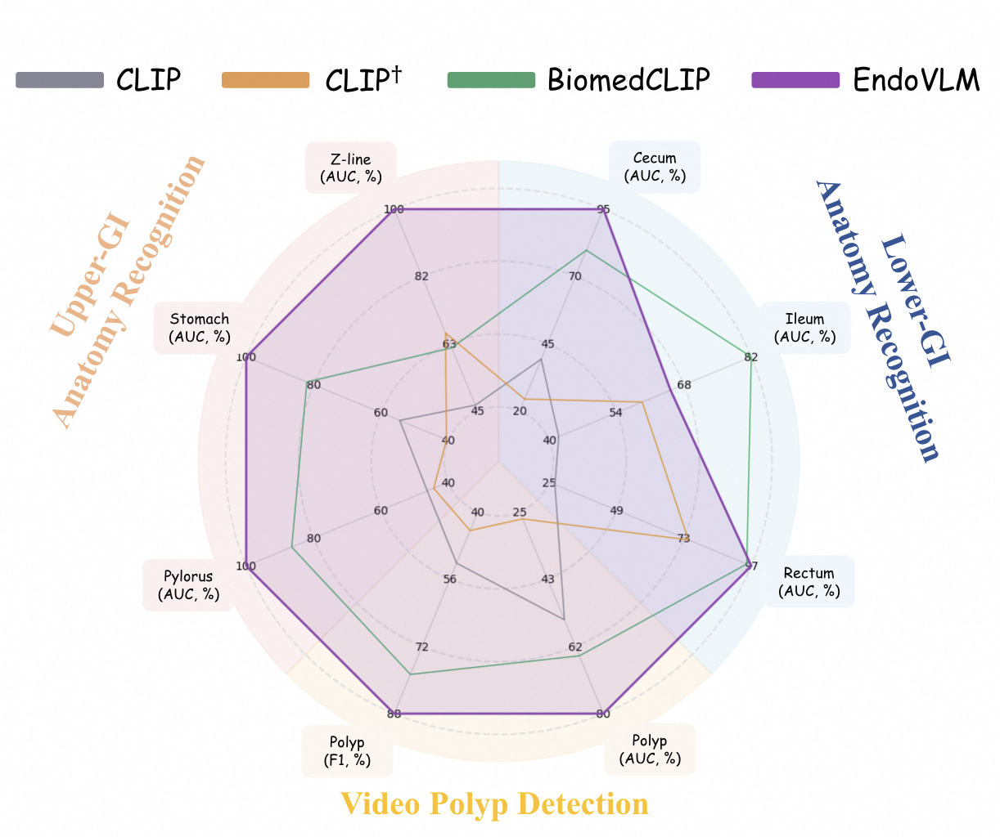
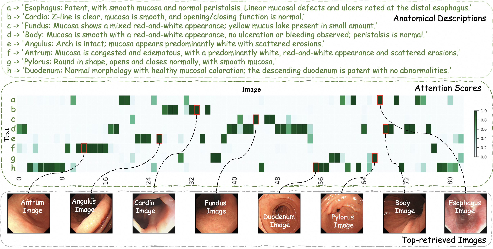
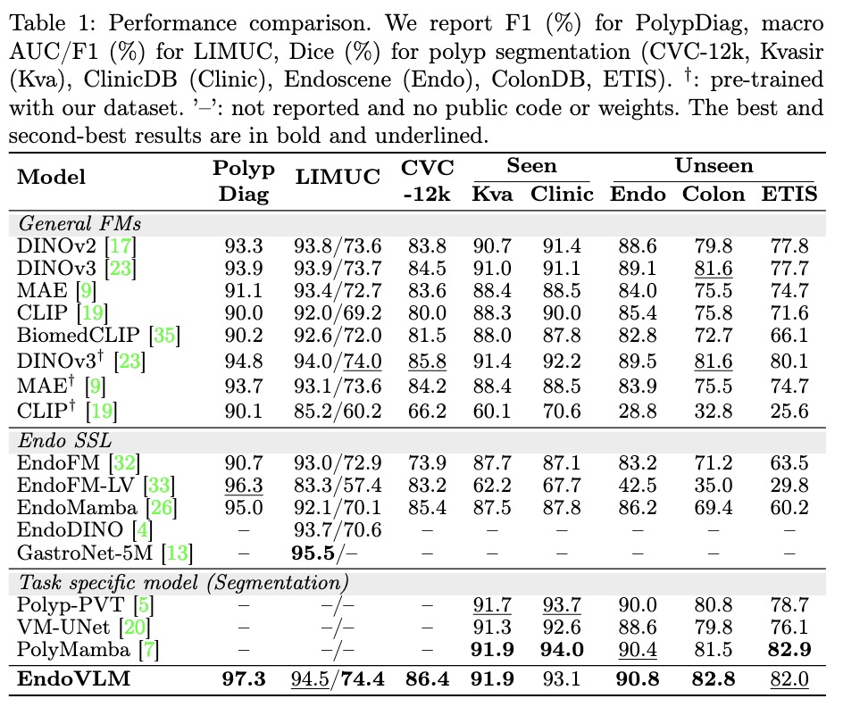

# EndoVLM: An Endoscopy Vision-Language Pre-training Model via Anatomy-Guided Sparsity and Progressive Alignment


## 📖 Introduction

**EndoVLM** is the first vision-language foundation model pre-trained on a massive dataset of 348K unordered endoscopic image sets paired with comprehensive gastrointestinal clinical reports. By resolving the profound semantic gap between highly redundant visual frames and structured clinical narratives, EndoVLM provides a highly scalable and robust foundation for next-generation AI-assisted endoscopy.

<p align="center">
  
</p>

## 🌟 Key Highlights

* **Anatomy-Guided Sparse Pooling (AGSP)**: Efficiently distills semantically salient frames from noisy, unordered image sets without relying on unreliable temporal priors.
* **Progressive Semantic-Aware Alignment (PSAA)**: Explicitly encodes clinical taxonomy into soft targets, enabling a robust transition from global patient-level matching to fine-grained anatomical and pathological alignment.
* **Semantic-Concentrated Masked Autoencoder (SC-MAE)**: Preserves fine-grained diagnostic textures and geometric precision as a complementary regularization.
* **Exceptional Zero-Shot Generalization**: Achieves flawless transferability (~100% AUC) in Upper-GI Anatomy Recognition and significantly outperforms existing baselines (e.g., BiomedCLIP) in challenging dynamic video analysis.
<p align="center">
  
</p>
<!--   -->
<!-- <p align="center">
  
</p> -->

* **Downstream Experiments Across Various Tasks:**
<p align="center">
  
</p>


---

## 📂 Repository Structure

The codebase is organized as follows to facilitate reproducibility:

* `dataset/`: Data loaders for handling unordered image sets and raw clinical reports.
* `dinov3/`: Vision backbone architecture and configurations.
* `util/`: Utility functions, including metrics, logging, and distributed training tools.
* `endovlm.py`: Core architecture implementation (AGSP, PSAA, SC-MAE).
* `engine_pretrain.py`: Training, evaluation, and logging loops for the pre-training phase.
* `main_pretrain.py`: Main entry script for distributed pre-training.
* `main_pretrain.sh`: Shell script containing hyperparameters to launch the training pipeline.
* `llm_extraction/`: LLM-based annotation pipeline for extracting structured anatomy/pathology labels from raw clinical reports.
* `inference.ipynb`: Zero-shot inference demo (upper-GI anatomy recognition) on the bundled samples.
* `pretrained/`: Directory for backbone / released checkpoint weights (see [Released Checkpoint](#-released-checkpoint)).
* `data/zeroshot/`: Three bundled hyper-kvasir samples used by `inference.ipynb`.

---

## 🛠️ Installation

1. Clone this repository:
```bash
git clone git@github.com:Scatteredrain/EndoVLM.git
cd EndoVLM

```

2. Create a conda environment and install dependencies:


```bash
conda create -n endovlm python=3.11
conda activate endovlm

# Install core dependencies
pip install torch transformers open-clip-torch timm

```

---

## 🗄️ Data Preparation

EndoVLM is pre-trained on unordered image sets and corresponding clinical reports. To reproduce our pipeline, please organize your dataset in the following structure, or adjust the parsers in `dataset/` accordingly:

```text
data/
├── images/
│   ├── patient_000000001/
│   │   ├── image_0001.jpg
│   │   ├── image_0002.jpg
│   │   └── ...
│   └── ...
└── reports/
    └── clinical_reports.json  # Contains patient-level reports and taxonomy labels

```

*(Note: Due to patient privacy and ethical guidelines, the 348K pre-training dataset cannot be released at this stage. We provide toy examples in the `data/` folder for pipeline verification.)*

---

## 🚀 Pre-training

We provide a streamlined shell script to launch the distributed pre-training process. Hyperparameters (e.g., learning rate, batch size, temperature, top-K for AGSP) can be modified directly inside the script.

To start pre-training:

```bash
bash main_pretrain.sh

```

The script calls `main_pretrain.py`, which initializes the model from `endovlm.py` and executes the optimization loop defined in `engine_pretrain.py`.

---

## 🏷️ LLM-based Data Annotation (`llm_extraction/`)

The structured anatomy and pathology labels used for pre-training are generated via LLM-based annotation. The script `llm_extraction/extract_anato_patho.py` contains all four annotation tasks with their full prompts (in English, assuming English-language input reports):

### Quick Start

```bash
# Install dependencies
pip install openai tqdm

# Set your DashScope (Alibaba Cloud) API key
export DASHSCOPE_API_KEY="your-api-key"

# Run
python llm_extraction/extract_anatomy_pathology.py \
    --base_url your_api_base_url \
    --input data/reports.jsonl \
    --output data/reports_annotated.jsonl

```

---

## 📦 Released Checkpoint

We release the ViT-B/16 EndoVLM model reported in the paper:

| Checkpoint | Backbone | Text Encoder |
|---|---|---|
| `pretrained/endovlm_vitb16.pth` | DINOv3 ViT-B/16 | BiomedCLIP PubMedBERT |

Download the weight file (~854 MB) from HuggingFace ([`Scatteredrain/EndoVLM`](https://huggingface.co/Scatteredrain/EndoVLM)) and place it at `pretrained/endovlm_vitb16.pth`.

---

## 📈 Evaluation & Inference

### Zero-Shot Inference Demo

`inference.ipynb` runs zero-shot upper-GI anatomy recognition on three bundled hyper-kvasir samples (`data/zeroshot/`), following the prompt-based protocol of the paper. Put the released checkpoint at `pretrained/endovlm_vitb16.pth` and run the notebook from the repository root.

Example inference snippet:

```python
import torch
import torch.nn.functional as F
import open_clip
from endovlm import build_endovlm

tokenizer = open_clip.get_tokenizer('hf-hub:microsoft/BiomedCLIP-PubMedBERT_256-vit_base_patch16_224')

# Build the model, then load the released weights
model = build_endovlm(model_type='vit_base_patch16')
msg = model.load_state_dict(
    torch.load('pretrained/endovlm_vitb16.pth', map_location='cpu', weights_only=False)['model'],
    strict=False,
)
model.eval()

# Extract fine-grained (anatomy-level) image features
latent, _, _ = model.forward_encoder(image_tensor, 0.0)
cls_tokens = latent[:, 0]
patch_tokens = latent[:, 1 + model.encoder.n_storage_tokens:]
feat = model.image_feat_projection(torch.cat([cls_tokens, patch_tokens.mean(dim=1)], dim=1))
image_features = F.normalize(model.image_projection_fg(feat), p=2, dim=-1)

# Extract text features
text_features = F.normalize(model.forward_text(tokenizer(["An endoscopic image of pylorus."])), p=2, dim=-1)

```
